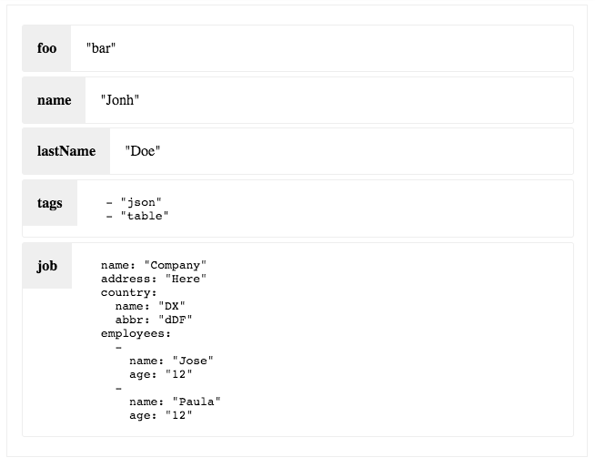

# JSON Table
A Simple component to show an object in a table format.


## Example

```shell 
$ npm install simple-json-table --save
```

```javascript
import React from 'react';
import ReactDOM from 'react-dom';
import JSONTable from 'simple-json-table'; 

const source = {
  foo: 'bar',
  name: 'Jonh',
  lastName: 'Doe',
  tags: ['json', 'table'],
  job: {
    name: 'Company',
    address: 'Here',
    country: {
      name: 'DX',
      abbr: 'dDF'
    },
    employees: [
      {
        name: 'Jose',
        age: '12'
      },
      {
        name: 'Paula',
        age: '12'
      }
    ]
  }
};

ReactDOM.render(
  <JSONTable source={source} />,
  document.getElementById('root')
);

```



## Component Properties

#### `source`: object
the source object to show


## Comments
Feel free to make any suggestion to improve this component.

